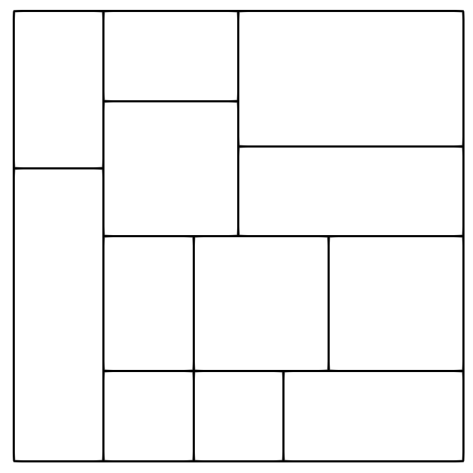

# T-spline
Given a 2D parameter space and a set of 3D control points, get the corresponding T-spline surface. You can also get the faces of T-mesh and the extensions-vertices of it.

Example

Parameter space

T-spline surface

Control points

